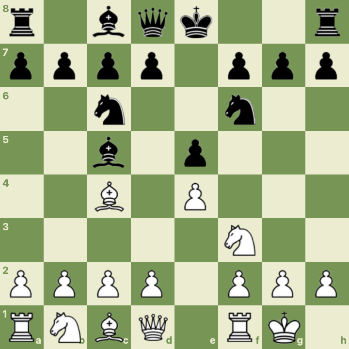

# CINES

Two player chess for the desktop, in Qt 6.



## What it does

Chess, by the actual rules.
Castling, en passant, promotion to any piece,
check, checkmate and stalemate,
and the three ways a game can be drawn without either side agreeing to it:
the fifty-move rule, threefold repetition, and material neither side can mate with.

The board scales with the window and stays square.
Pieces are drawn from SVG, so they stay sharp at any size and on a high density display.
Legal moves are shown as you pick a piece up —
a dot for a quiet move, a ring for a capture —
and the last move played stays marked so you can see what just happened.
A king in check is marked in red.

Move by clicking twice or by dragging.
Pieces glide to their squares rather than jumping.
The board follows your desktop's light or dark setting, or you can pick one.

Alongside the board: the moves so far in algebraic notation,
which you can click to rewind through the game;
what each side has captured, with the material difference;
and Copy Position (FEN) and Copy Game (PGN) for taking a game elsewhere.

## Installing

macOS, via Homebrew:

```
brew install --cask sanketsudake/tap/cines
```

Linux, Windows and macOS builds are attached to
[each release](https://github.com/sanketsudake/CHESS-in-Qt/releases) —
an AppImage, a portable zip, and a disk image.

The macOS build is not signed with an Apple Developer ID.
Homebrew handles that for you;
if you download the disk image directly,
open the application the first time with right-click → Open.

## Building

Needs CMake 3.25 or newer, a C++20 compiler, and Qt 6.8 or newer.

```
cmake --preset dev
cmake --build --preset dev
ctest --preset dev
./build/dev/src/app/CINES        # CINES.app/Contents/MacOS/CINES on macOS
```

Qt is found through `CMAKE_PREFIX_PATH` if it is not on the default search path:

```
CMAKE_PREFIX_PATH=/opt/homebrew/opt/qt cmake --preset dev
```

Building only the rules, with no Qt at all, is `-DCINES_BUILD_APP=OFF`.

### Presets

| Preset | For |
|---|---|
| `dev` | Debug, assertions on, warnings not fatal |
| `release` | Optimised, tests off |
| `ci` | Warnings are errors |
| `ci-asan` | Address and undefined-behaviour sanitizers |
| `ci-coverage` | gcov instrumentation |

## How it is put together

The rules are a static library that **includes no Qt header**.
That is the load-bearing constraint:
it is what lets the rules be tested without a display,
and what would let the interface be replaced without touching them.

```
src/core/     the rules      no Qt, ~250 tests
src/app/      the interface  Qt 6 Widgets
tools/        board_snapshot renders a position to a PNG with no window
```

Inside the rules, each type owns one thing:
`Board` is piece placement, `Position` adds side to move and castling rights,
`MoveGenerator` produces moves, `Rules` decides check and how a game ended,
`Game` keeps the history.
The interface never reasons about castling or whose turn it is —
`GameController` is the only place the two meet.

### Are the rules right?

Move generation is checked by [perft](https://www.chessprogramming.org/Perft):
counting the leaf nodes of the move tree to a fixed depth
and comparing against published counts.
The numbers are exact,
so a single mishandled castling or en passant case shows up as a wrong number
rather than as a bug found during a game.

All six standard positions match, every one to depth 4,
and separately verified deeper — the start position to depth 6 (119,060,324 nodes)
and Kiwipete to depth 5 (193,690,690).

```
cmake --preset dev -DCINES_SLOW_TESTS=ON   # adds the deep levels
```

## History

Written in 2012 by Sagar Rakshe, Nisarg Patel, Sanket Sudake and Nikhil Pachpande,
as a Qt 4 application.
Rewritten in 2026 against Qt 6.

The original kept its state in globals — two of them named `exp` and `max`,
which shadow `<cmath>` — and fused board square, piece, painter and rule engine
into one `QLabel` subclass.
Its `check()` returned zero unconditionally, so no game ever ended,
and there was no castling, no en passant and no promotion.
The rules are new; the piece artwork is the original.

## Licence

GPL-3.0-or-later. See [LICENSE](LICENSE), and [COPYING](COPYING) for the original authorship.
